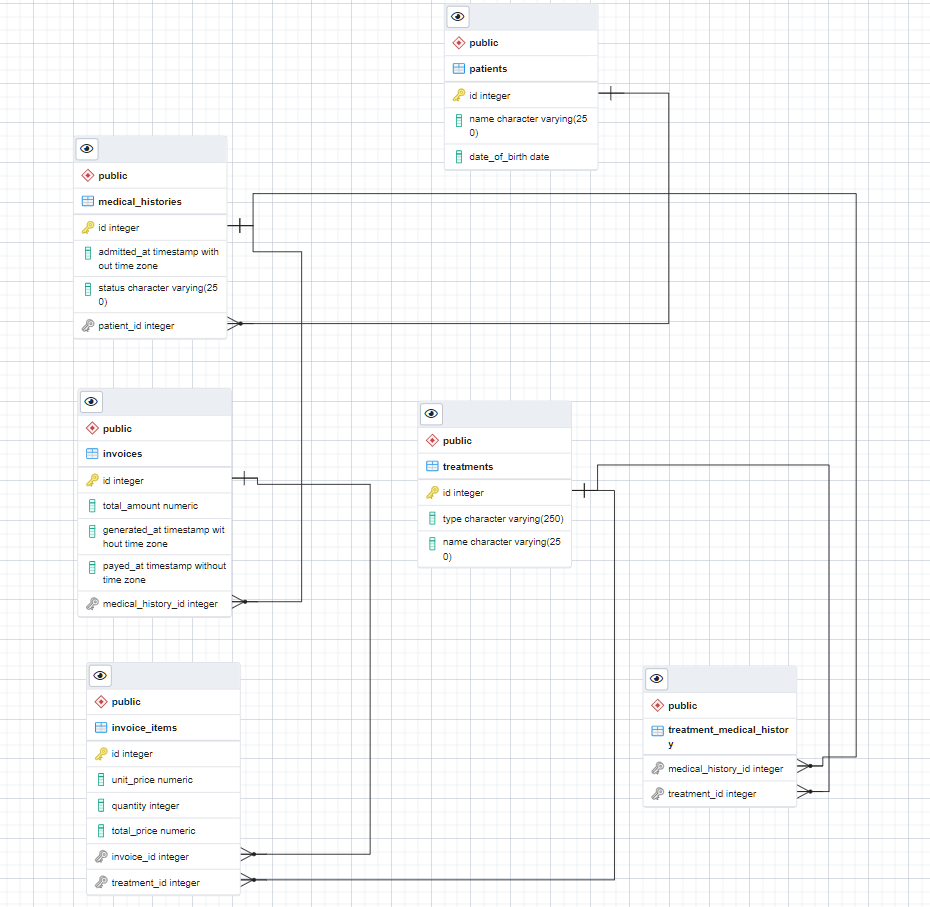

# Medical Clinic Database

> This repository is about the development of a database coming from an assigned ER diagram provided by Microverse.



- This database has tables, primary keys, foreign keys and indexes for each foreign to perform the query search faster.

## Built With

- PostgreSQL

## Getting Started

### Prerequisites

- A code editor of your preference.
- PostgreSQL.

### Install

- Clone the repository from gitHub
```
git clone <REPO-NAME>

```
- Use the follow code in your postgreSQL command line to create the database and all its entities automatically.
```
\i schema_based_on_diagram ;

```
## Authors

👤 **Author1**

- GitHub: [Enmanuel Lassis](https://github.com/elassis)
- LinkedIn: [Enmanuel Lassis](https://linkedin.com/in/enmanuel-lassis-pena)

👤 **Leonardo Paz** (Performance audit)

- Github: [Leonardo Paz](https://github.com/leolpaz)
- Twitter: [Leonardo Paz](https://twitter.com/leonardolpaz95)
- Linkedin: [Leonardo Paz](https://www.linkedin.com/in/leonardolpaz/)

## 🤝 Contributing

Contributions, issues, and feature requests are welcome!

Feel free to check the [issues page](../../issues/).

## Show your support

Give a ⭐️ if you like this project!

## 📝 License

This project is [MIT](./MIT.md) licensed.
